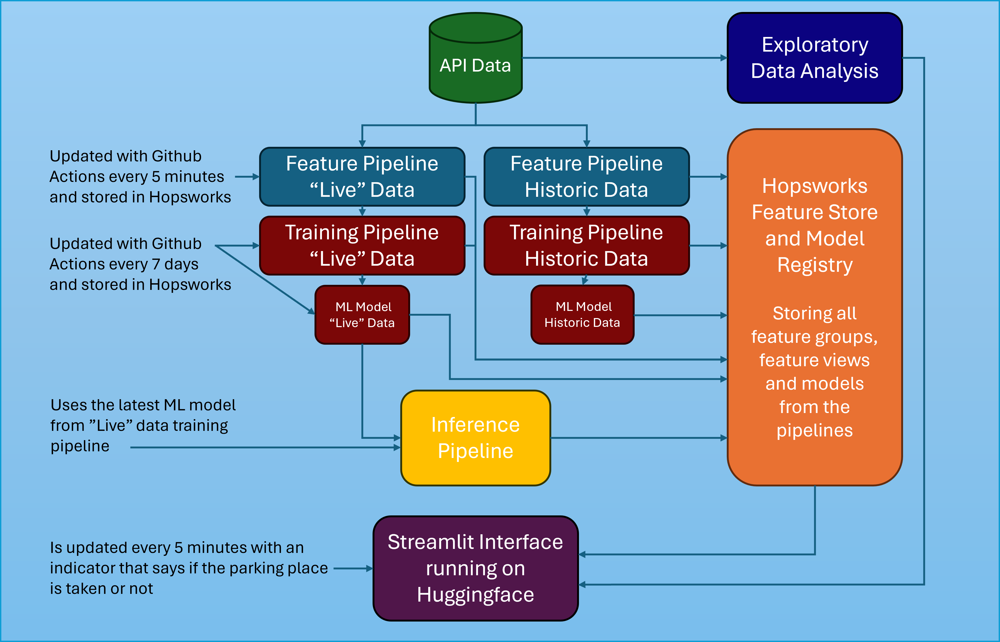

# 🚀 Data Engineering and Machine Learning Operations in Business - MLOps Assignment 🤖

This repository contains all resources for the 2nd semester project. Our project aims to improve the understanding of unfluencing features and develop a scalable Serverless Parking Occupancy Detection System that leverages sensor data, and weather variables, for two parking spots near an office building. This tool can help parking operators, businesses, and city planners optimize parking space utilization.

## 👥 Group Members

- Annika Í Jákupsstovu - 20204059
- Mikkel Ørts Nielsen - 20205211

## 🚗 Live Status on Two Parking Spots
---> [Parking Occupancy Detection](https://huggingface.co/spaces/AM-MLOps/POD_System_Sensor_Data) <---

**This application is divided into 2 tabs:**

The first tab displays the parking space near the building, and the second tab shows the parking space near the bike lane.

Both tabs contain two small data frames with the latest predictions on whether or not there is a vehicle detected in the parking lot. One data frame shows predictions based on electromagnetic field data, and the other is based on weather data.

Below the two data frames are two graphs that visualize the normalized values of both the electromagnetic field data and radar data. These graphs can help the user understand when a vehicle is parked or not.

## 📂 Structure

### 📊 Data

The data has been accessed through a collaboration with a major provider of wireless parking sensors in Denmark. The company gathers both historical and real-time sensor data which can be accessed through their RESTful API. In addition to this, the company also offers customers access to a platform with an overview of the parking conditions in different cities. 

We got access to the company’s RESTful API. This gave us access to two parking spaces outside the company’s office. As one of the parking places was nearer the building and the other closer to a bike lane, we differ between them as “building” and “bikelane”. The final pipeline is built using data from these two parking places

Historical data from the API is saved in two CSV-files found in the folder *notebooks*.

Furthermore, the  Open-meteo API is used to gather both historical and real-time data. For the historical data, we went to Open-meteo’s historical weather API, selected the geographical coordinates of the two parking places we got access to and specified the time interval to 1st of March to the 30th of April. 

### 📓 Notebooks

The five notebooks in the folder "**notebooks**" are the final notebooks required to create and maintain the parking occupancy detection system.

- **1_historic_api_feature_pipeline**: Historical data is gathered through an API. Preprocessing and feature engineering are applied, and the data is uploaded to Hopsworks Feature Store as a Feature Group.
- **2_latest_api_feature_pipeline**: New data is gathered through the API. Preprocessing and feature engineering are applied, and the data is uploaded to Hopsworks Feature Store as a Feature Group.
- **3_featureview_creation**: This notebook is where feature views for training data are built. This includes feature views for historical and new data.
- **4_model_training**: In this notebook, models for each parking spot are either made with historical data or updated with new data.
- **5_inference_pipeline**: This notebook's purpose is to gather the latest data from the API (saved in a feature group) and try to predict parking occupancy for each parking spot.

### 📊 EDA

To get a better understanding of the datasets, we made some exploratory data analysis (EDA) notebooks at the start of the process. We first made an EDA for the building parking lot and then copied this notebook to explore the other parking spot in the same manner. Our findings from these EDAs can be found under *notebooks* in the *EDA* folder.

### 🧠 Models

The different models that have been developed throughout the assignment are found under the *models* folder. There is also a confusion matrix for each model, describing the accuracy of the model.

### 🐍 Python Scripts

Python scripts are found in the *python_scripts* folder. These scripts are the notebooks converted to executable scripts. The scripts can then be executed by GitHub Actions automatically, thereby automatically gathering new data from the API, updating the models, and making predictions.

## 🏗️ System Architecture

The architecture for this assignment is described visually to understand the connections between data, pipelines, feature storage, and interface:

  

