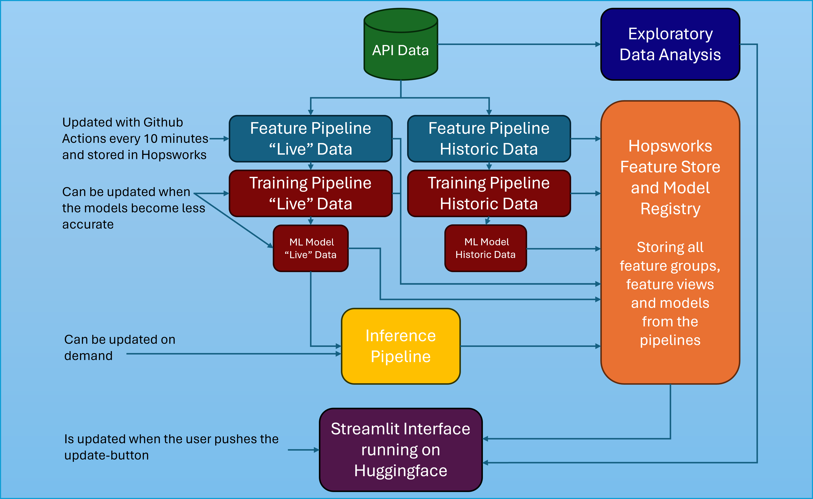

# 🚀 Data Engineering and Machine Learning Operations in Business - MLOps Assignment 🤖

This repository contains all resources for the final assignment of the MLOps Module. Our project aims to develop a scalable Parking Occupancy Detection System that leverages sensor data for live vehicle detection at two parking spots near an office building. This tool can help parking operators, businesses, and city planners optimize parking space utilization.

## 👥 Group Members

- Annika Í Jákupsstovu - 20204059
- Mikkel Ørts Nielsen - 20205211

## 🚗 Live Status on Two Parking Spots
---> [Parking Occupancy Detection](https://huggingface.co/spaces/AM-MLOps/Parking_occupancy_detection) <---

**This application is divided into 5 tabs:**

- Parking lot status: The first tab includes the actual interface, where the goal has been to make a simple UI which shows if 2 parking spaces are occupied or available.
- Magnetic Field Explorer: The second tabs is made for exploring the models, where the user can test different values for x, y and z and get a prediction
- About: In the third tab you can get some information about the interface.
- Dataset and visualisations: The fourth tab contains an overview of the training data and also includes EDAs for each individual parking space. The goal with these EDAs is to give you some information about when the parking spaces usually are occupied.
- Model Performance: The fifth tab explains how the underlying Machine Learning Model performs and how the predictor works.

## 📝 Assignment Requirements

- **A Prediction System:** An ML-based solution to accurately predict parking occupancy and vehicle type.
- **API Integration:** Real-time data acquisition via external sensors.
- **Interactive Interface:** A user-friendly dashboard for visualizing the prediction results.

## 🎯 Assignment Objective

The objective for the assignment is to identify reliable methods and developer platforms for programming a Parking Occupancy Detection System running on a Serverless Machine Learning Pipeline.

## 📂 Structure

### 📊 Data

The data has been accessed through a collaboration with a major provider of wireless parking sensors in Denmark. The company gathers both historical and real-time sensor data which can be accessed through their RESTful API. In addition to this, the company also offers customers access to a platform with an overview of the parking conditions in different cities. 

At first we got access to 9 CSV-files with extract data from 9 parking places; 3 normal parking places, 3 forbidden areas and 3 parking places with charging stations. We chose to make the initial pipeline using data from the 3 parking places with charging stations; EL1, EL2 and EL3. The reasoning behind this decision is that our supervisor and we assumed that it would be easier to detect if a vehicle was located in the parking place due to them having to park close to the charging stations. We assumed that the parking varied more in normal parking places than in those having charging stations. 

These 9 CSV-files can be found in the *data* folder.

One week before hand-in, we got access to the company’s RESTful API. This gave us access to two parking spaces outside the company’s office. As one of the parking places was nearer the building and the other closer to a bike lane, we differ between them as “building” and “bikelane”. The final pipeline is built using data from these two parking places

Historical data from the API is saved in two CSV-files found in the folder *notebooks*.

### 📓 Notebooks

The five notebooks in the folder "**notebooks**" are the final notebooks required to create and maintain the parking occupancy detection system.

- **1_historic_api_feature_pipeline**: Historical data is gathered through an API. Preprocessing and feature engineering are applied, and the data is uploaded to Hopsworks Feature Store as a Feature Group.
- **2_latest_api_feature_pipeline**: New data is gathered through the API. Preprocessing and feature engineering are applied, and the data is uploaded to Hopsworks Feature Store as a Feature Group.
- **3_featureview_creation**: This notebook is where feature views for training data are built. This includes feature views for historical and new data.
- **4_model_training**: In this notebook, models for each parking spot are either made with historical data or updated with new data.
- **5_inference_pipeline**: This notebook's purpose is to gather the latest data from the API (saved in a feature group) and try to predict parking occupancy for each parking spot.

### 📊 EDA

To get a better understanding of the datasets, we made some exploratory data analysis (EDA) notebooks at the start of the process. We first made an EDA for EL1 and then copied this notebook to explore the other datasets in the same manner. Our findings from these EDAs can be found under *notebooks* in the *EDA* folder.

### 🧠 Models

The different models that have been developed throughout the assignment are found under the *models* folder. There is also a confusion matrix for each model, describing the accuracy of the model.

### 🐍 Python Scripts

Python scripts are found in the *python_scripts* folder. These scripts are the notebooks converted to executable scripts. The scripts can then be executed by GitHub Actions automatically, thereby automatically gathering new data from the API, updating the models, and making predictions.

## 🏗️ System Architecture

The architecture for this assignment is described visually to understand the connections between data, pipelines, feature storage, and interface:

  

